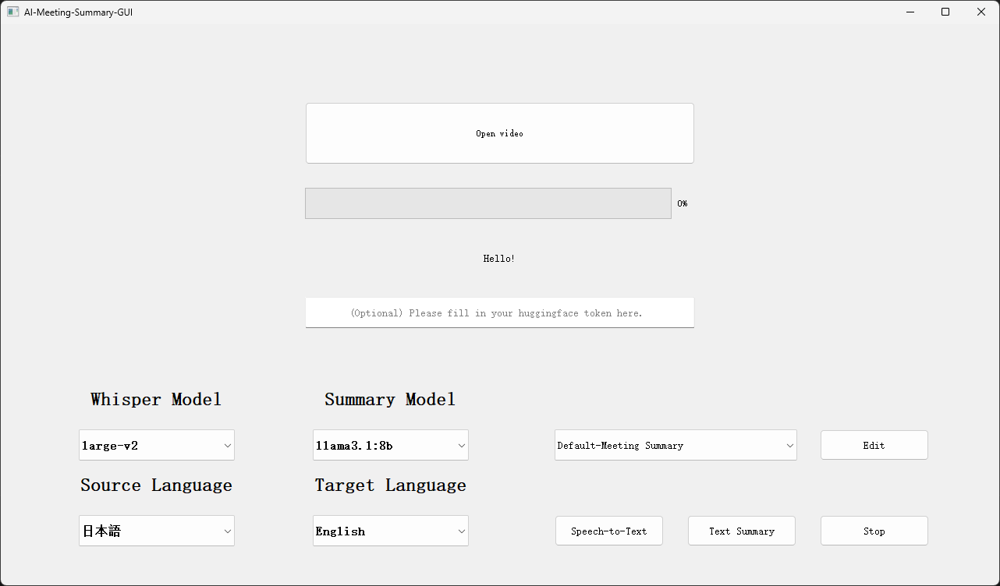
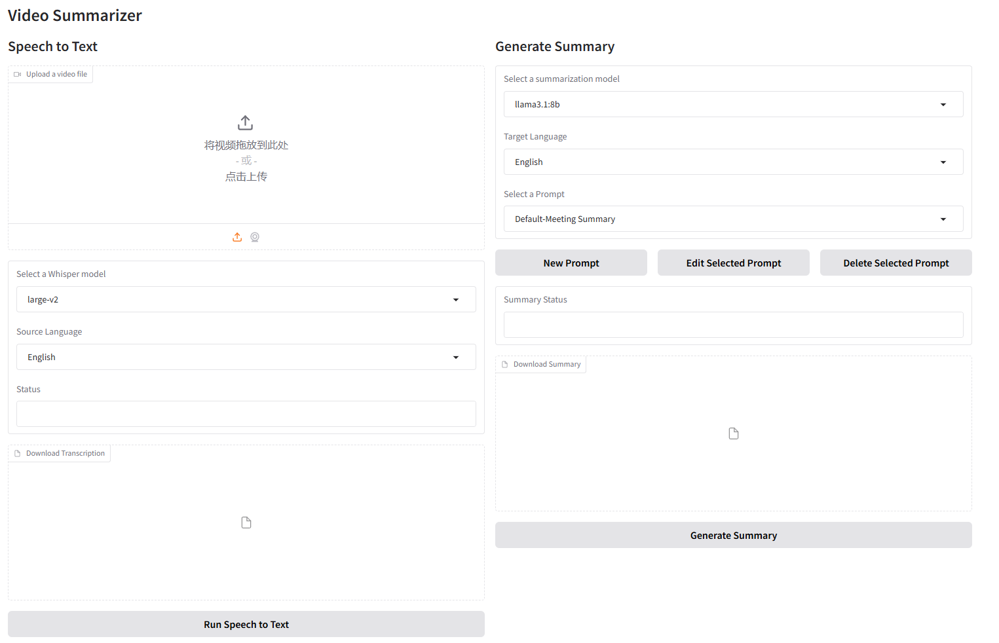

# AI-Meeting-Summary-GUI

## What's this
The AI-Meeting-Summary-GUI tool is designed to automatically transcribe and summarize meeting videos.  
Use the fast-whisper model for speech transcription and an optional large language model based on ollama for summarization.  
It enables users to upload a video, extract audio, run speech recognition to produce a transcription, and generate a summary based on the transcribed content.  
Users can choose between a PyQt-based GUI and a Gradio web app for interaction, allowing flexibility depending on the preferred interface.

## Installation Instructions
You need to install CUDA and cuDNN
(Currently there are no problems with 11.7 and 12.1 tests)  

To extract audio, you need to download ffmpeg  
https://www.ffmpeg.org/

You need to download ollama and download the model for summarization  

Download Ollama  
https://ollama.com/  

Download model (For example llama3.1) 
```bash
ollama pull llama3.1
```

Create and start a virtual environment
```bash
conda create -n ai-meeting python=3.10
conda activate ai-meeting
```

Install torch
```bash
pip install torch==2.4.1 torchvision==0.19.1 torchaudio==2.4.1 --index-url https://download.pytorch.org/whl/cu121
# pip install torch==1.13.1+cu117 torchvision==0.14.1+cu117 torchaudio==0.13.1 --extra-index-url https://download.pytorch.org/whl/cu117
```

Install other requirements
```bash
pip install -r requirements.txt
```

Run the tool
```bash
python pyqt_app.py
python gradio_app.py
```

## PyQT-APP

"Click or drag a video into the 'Open video' button to select a video.  

You can choose a speech recognition model and a summarization model. The summarization model is downloaded from Ollama.  

The source language is the language of the video, while the target language is the language in which the summarization results will be displayed.  

The right-side prompt includes some built-in prompts. Please select one according to your needs, or you can customize it.  

Click 'Speech-to-Text' to generate transcription results. (The first time requires downloading the Whisper model, which may take some time. To check the download progress, please view the terminal.)  

Click 'Text Summary' to summarize the transcription results using the selected summarization model.  

Audio results are saved in the ```temp``` folder.  
Transcription and summary results are saved in the ```result/{video_name}``` folder.  
Click 'Stop' to clear the temp folder."  

## Gradio-APP


Similar to Pyqt-APP.  

Added the Edit Prompt function, which allows you to view the currently used prompt, create a new prompt, and save it.

The default access address is
```bash
http://127.0.0.1:7860
```
If you need to share in the LAN, please open the last line
```bash
iface.launch(share=True)
```

## Referenced Projects
- [ollama-python](https://github.com/ollama/ollama-python)
- [faster-whisper](https://github.com/SYSTRAN/faster-whisper)
- [faster-whisper-GUI](https://github.com/CheshireCC/faster-whisper-GUI)


## To be updated
- Support fine-tuned models (based on Hugging Face)
- Real-time subtitle/translation function